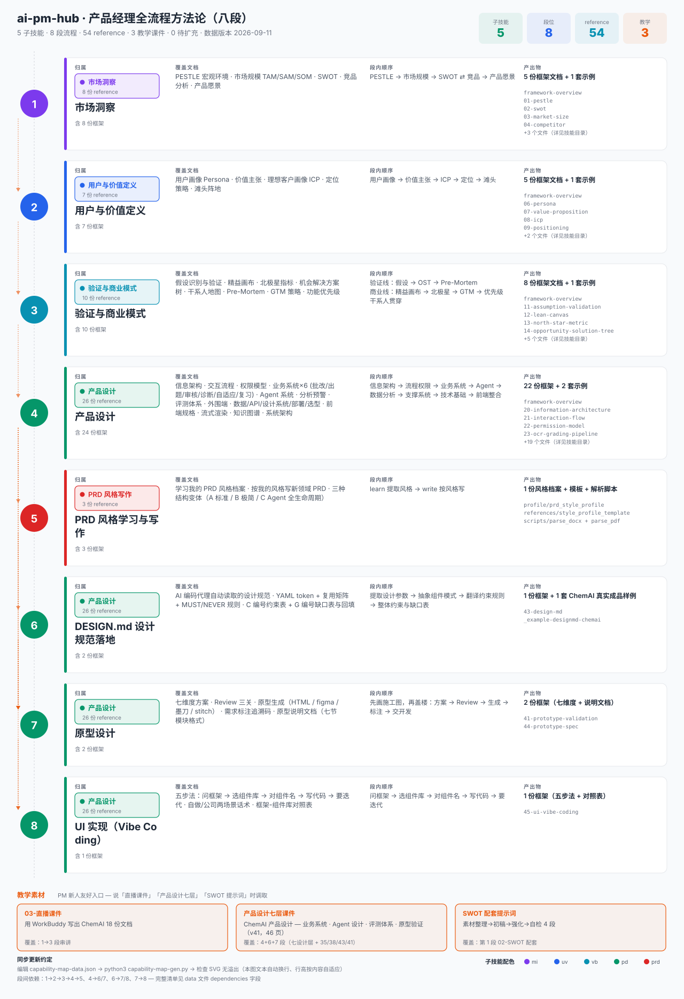

# AI 产品经理方法论中心（ai-pm-hub）

> **5 子技能 · 8 段流程 · 54 reference** —— 跨领域通用、可被 AI 代理自动读取的产品全流程方法论沉淀

[](LICENSE)
[](skills/ai-pm-hub/SKILL.md)
[](CONTRIBUTING.md)



## 这是什么

**ai-pm-hub** 是一个**跨领域通用**的产品经理方法论中心。它把从「市场洞察」到「UI 实现」的完整链路拆成 **8 个段位**，每个段位由 1 个独立的「子技能」（`market-insight-writer` / `user-value-definer` / `validation-business-model` / `product-design-writer` / `prd-style-learner`）承载，提供：

- **5 套方法论框架**：每套 5–22 份 reference 文档，五段式结构（回答什么问题 / 怎么分析 / 文档结构 / 及格线 / 最易挂的坑）
- **1 张可同步更新的能力地图**：数据 + 生成器 + SVG 三件套，改 JSON 一键再生
- **0 行业绑定**：所有方法论都是「跨领域通用骨架」，样例已做去行业化处理

适用于：任何需要写市场洞察、用户画像、价值主张、精益画布、原型方案、DESIGN.md、PRD 的产品经理 / 产品负责人 / AI 工程师。

## ⚠️ 重要声明：方法论 vs 样例

本仓库的内容**分两类**，权利归属不同：

| 类别 | 内容 | 权利归属 |
|------|------|---------|
| **方法论框架** | SKILL.md / reference / 能力地图三件套 / docs/ 设计文档 | 作者原创，MIT 授权 |
| **样例文件** | `_example-*.md` | 基于第三方培训素材的方法论重构，已脱敏为占位符 |

**样例不是「事实陈述」**，而是「方法论的呈现模板」。读者应：

1. 视样例为「方法论长什么样的示例」
2. 不应将样例中的占位符替换为真实产品名后当作事实证据
3. 自行确保使用样例时符合当地法律法规与第三方权利

详细权利划分与免责条款见 [NOTICE](NOTICE)。

## 八段全流程

```
1 市场洞察 ─→ 2 用户与价值 ─→ 3 验证与商业 ─→ 4 产品设计 ─→ 5 PRD ─→ 6 DESIGN.md ─→ 7 原型设计 ─→ 8 UI 实现
 ✅ 已启用      ✅ 已启用         ✅ 已启用         ✅ 已启用     ✅ 已启用    ✅ 已启用       ✅ 已启用      ✅ 已启用
```

| 段 | 能力 | 归属子技能 | 覆盖 |
|----|------|-----------|------|
| 1 | 市场洞察 | `market-insight-writer` | PESTLE · 市场规模 · SWOT · 竞品 · 愿景 |
| 2 | 用户与价值定义 | `user-value-definer` | Persona · 价值主张 · ICP · 定位 · 滩头 |
| 3 | 验证与商业模式 | `validation-business-model` | 假设验证 · 画布 · 北极星 · OST · 干系人 · Pre-Mortem · GTM · 优先级 |
| 4 | 产品设计 | `product-design-writer` | 信息架构·流程·权限·业务×6·Agent·分析·评测·外围·技术·前端·渲染·知识·架构 |
| 5 | PRD 风格写作 | `prd-style-learner` | 学习你的 PRD 风格 → 按风格写新 PRD |
| 6 | DESIGN.md 设计规范 | `product-design-writer` (43) | AI 编码代理自动遵守的视觉规范 |
| 7 | 原型设计 | `product-design-writer` (41+44) | 七维度方案 → Review 三关 → 生成 → 标注 → 说明文档 |
| 8 | UI 实现（Vibe Coding） | `product-design-writer` (45) | 五步法：问框架→选库→对组件→写代码→迭代 |

## 快速开始

### 1. 在 WorkBuddy 中使用

```bash
# 软链接到 WorkBuddy skills 目录
ln -s $(pwd)/skills/ai-pm-hub ~/.workbuddy/skills/ai-pm-hub
ln -s $(pwd)/skills/market-insight-writer ~/.workbuddy/skills/market-insight-writer
ln -s $(pwd)/skills/user-value-definer ~/.workbuddy/skills/user-value-definer
ln -s $(pwd)/skills/validation-business-model ~/.workbuddy/skills/validation-business-model
ln -s $(pwd)/skills/product-design-writer ~/.workbuddy/skills/product-design-writer
ln -s $(pwd)/skills/prd-style-learner ~/.workbuddy/skills/prd-style-learner
```

### 2. 单独使用某个 reference

每份 reference 文档都遵循五段式结构，**不依赖 WorkBuddy** 即可阅读与使用：

```bash
cat skills/market-insight-writer/references/02-swot.md
```

### 3. 重新生成能力地图

```bash
python3 tools/capability-map-gen.py
# 读 tools/capability-map-data.json
# 写 docs/images/capability-map.svg
```

## 仓库结构

```
ai-pm-hub/
├── README.md                              # 本文件
├── LICENSE                                 # MIT 协议
├── NOTICE                                  # 第三方权利与引用声明
├── CONTRIBUTING.md                         # 贡献指南
├── CODE_OF_CONDUCT.md                      # 社区准则
├── CHANGELOG.md                            # 变更记录
├── docs/                                   # 设计文档
│   ├── 00-overview.md
│   ├── 01-methodology.md
│   ├── 02-anti-plagiarism.md
│   ├── 03-framework-design.md
│   ├── 04-how-to-extend.md
│   ├── 05-capability-map.md
│   └── images/
│       └── capability-map.svg
├── skills/                                 # 5 子技能 + 1 总入口
│   ├── ai-pm-hub/                          # 总入口
│   ├── market-insight-writer/              # 第 1 段
│   ├── user-value-definer/                 # 第 2 段
│   ├── validation-business-model/          # 第 3 段
│   ├── product-design-writer/              # 第 4+6+7+8 段
│   └── prd-style-learner/                  # 第 5 段
└── tools/
    └── capability-map-gen.py               # 谱系图生成器
```

## 文档导览

- **新手**：[docs/00-overview.md](docs/00-overview.md) → [docs/01-methodology.md](docs/01-methodology.md)
- **反抄袭与去行业化说明**：[docs/02-anti-plagiarism.md](docs/02-anti-plagiarism.md) 与 [NOTICE](NOTICE)
- **想贡献**：[CONTRIBUTING.md](CONTRIBUTING.md) → [docs/04-how-to-extend.md](docs/04-how-to-extend.md)
- **能力地图全景**：[docs/images/capability-map.svg](docs/images/capability-map.svg)

## 引用与致谢

如果你在论文、博客、报告、衍生作品中使用了本仓库的方法论或样例，建议：

1. 引用本仓库的 GitHub URL
2. 致谢时写：「方法论框架来自 jlwangfever/ai-pm-hub，样例为基于第三方培训素材的方法论重构」
3. 保留 [LICENSE](LICENSE) 与 [NOTICE](NOTICE) 文件

## 协议

本仓库的方法论框架部分采用 [MIT](LICENSE) 协议开源。样例部分请遵守 [NOTICE](NOTICE) 中的引用规范。
