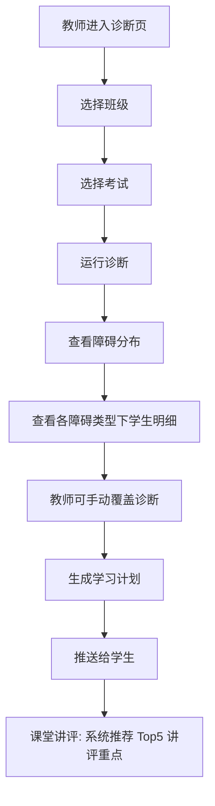

> 源文档：21-页面流程与交互设计.md

## 回答什么问题

用户在每个核心场景里怎么操作、系统怎么响应？三端之间数据怎么形成闭环？AI 对话的流式交互与审批中断怎么表达？把第 1 层（信息架构）的静态页面变成动态的用户操作路径。

核心产出：各端核心流程图（含关键接口）、跨端数据闭环时序图、SSE 与审批中断交互约定、用户故事→流程映射。

## 怎么设计（框架/步骤）

### 1. 按端拆核心流程

每端列 4-9 个核心流程（如教师端：入驻审批、批改闭环、出题→审核→考试、诊断讲评、学情导出、学生管理、自适应练习、预警处理；学生端：登录、辅导对话、练习、错题、复习、报告；家长端：绑定、查看、通知、助手）。每个流程用 Mermaid 流程图描述完整操作路径。

### 2. 每个流程图配「关键接口」

流程节点要落到 API：`POST/GET /api/...`，标注方法、路径、用途。流程与接口一一对应，禁止只有图没有接口。

### 3. 画跨端数据闭环（时序图）

选一条端到端链路（如教师出卷→学生作答→自动诊断→教师查看→外围角色接收），用时序图标出：参与者、API 调用、写库顺序、异步触发点。重点识别**写操作节点**（谁写入哪张表、写入什么），这是数据闭环设计的关键。

### 4. SSE 事件流与审批中断交互

交互式 AI 流程的流式协议（事件类型、时序、去重算法）和审批中断（确认→恢复、GuardState 门控）由 Agent 系统设计统一负责。本层只声明「这些交互存在、由 29 号文档定义」，不展开细节（单向依赖）。

### 5. 用户故事 → 流程映射

建表：故事编号、标题、Epic、对应本章流程、涉及 API。再按用户旅程阶段（如教师：考前/考后/诊断后/长期）归类。附「关键验收标准速查表」，把故事验收标准与流程节点绑定。

**示例流程片段（审题障碍 → 讲评闭环）**：

关键接口：`POST /api/diagnosis/run`、`GET /api/diagnosis/barrier/{class}/{exam}`、`PUT /api/diagnosis/override/{student}`。

## 文档结构

1. **各端核心流程**：每流程 = Mermaid 流程图 + 关键接口列表
2. **跨端数据闭环**：时序图 + 核心写操作顺序
3. **SSE 与审批中断交互**：声明交 Agent 文档定义 + 引用
4. **用户故事精华整合**：故事→流程映射表 + 旅程阶段归类 + 验收标准速查

## 及格线

- ☑ 每个核心流程都有流程图，且每个关键节点标注对应 API（方法+路径）
- ☑ 有至少一条跨端数据闭环时序图，并明确标出写操作节点（写入哪、写什么）
- ☑ 用户故事有→流程的映射表与验收标准绑定
- ☑ SSE/审批中断仅声明、引用 Agent 文档，未在本层展开（遵守单向依赖）
- ☑ 关键流程含异常/失败分支（如登录失败、审批驳回）

## 最易挂的坑

- **只画 happy path**：流程图只有成功路径，缺登录失败、审批驳回、超时等分支，等于没覆盖真实交互。
- **流程不落地到接口**：图很漂亮但没有 API 对应，工程无法执行；流程与接口必须 1:1。
- **闭环漏写操作节点**：跨端时序图只画查询不画写入，数据从哪来、落到哪张表说不清，后续统计/分析层无据可依。
